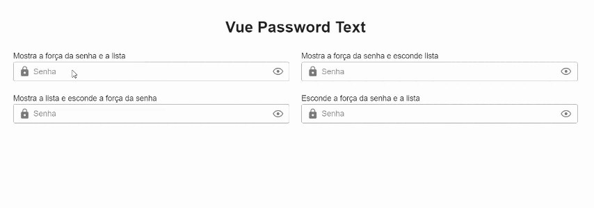

# Vue-Password-Text
É um componente Vue.js compatível com Vuetify 3.x, customizado para exibir e gerenciar um campo de senha, com recursos adicionais como verificação de força de senha e uma lista de requisitos.

## Install 
#### NPM 
Para usar o componente em seu projeto Vue 3, instale o pacote via NPM:

```bash 
npm install v-password-text
``` 
## Uso
No seu projeto Vue, importe e registre o componente:

```javascript 
import { createApp } from 'vue';
import App from './App.vue';
import vuetify from './plugins/vuetify';  // if you are already using Vuetify 
import VPasswordText from 'v-password-text';

const app = createApp(App);

app.use(vuetify);
app.component('v-password-text', VPasswordText);
app.mount('#app');
```
## Exemplo de Uso
Você pode usar o componente da seguinte maneira:

```vue

<template>
          <v-password-text :password="senha"
                           @update="(v)=>{senha=v}"
                           label="Senha"
                           :show_forca="true"
                           :show_list="true"
                           id="senha">
                   </v-password-text>
</template>

<script>
import { defineComponent } from 'vue';

export default defineComponent({
  data:()=>({
    senha: null,
  }),
});
</script>

```
#### Props
* password: (String) A senha atual que será vinculada ao componente. Use a diretiva v-model ou o evento @update para fazer o bind da senha.
* label: (String) O rótulo do campo de senha. Exemplo: "Senha".
* show_forca: (Boolean) Exibe ou não o medidor de força da senha. Defina como true para mostrar.
* show_list: (Boolean) Exibe ou não uma lista com os requisitos da senha. Defina como true para mostrar.
* id: (String) Um identificador único para o campo de senha. Necessário para associar o rótulo ao input.
* autocompletOff: (Boolean) Ativa ou desativa o autocomplete-off no imput.  Defina como true para não autocompletar o campo.

#### Events
* @update: Este evento é emitido sempre que a senha for atualizada. O valor da senha atualizada é passado como argumento para a função.

#### Funcionalidade
* Força da senha: Quando show_forca está ativado, o componente exibe um medidor que avalia a força da senha com base em critérios como comprimento e complexidade.
* Requisitos de senha: Quando show_list está ativado, o componente exibe uma lista com requisitos de senha que o usuário precisa cumprir (por exemplo, comprimento mínimo, presença de caracteres especiais, etc.).


#### Slots
Este componente atualmente não utiliza slots.

#### Referências
* https://primevue.org/password/ (based on primevue)
